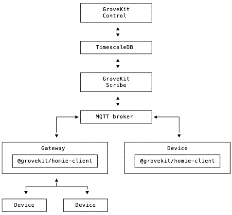

# GROVEKIT

Lightweight, self-hosted, opinionated IoT stack built on the
[Homie MQTT convention][homie], [Node.js] and [TypeScript].

## Table of Contents

- [Author](#author)
- [Status](#status)
- [Components](#components)
- [Architecture](#architecture)
- [Goals](#goals)
- [Principles](#principles)
- [Dependencies](#dependencies)

## Author

Grovekit is developed by [jacoscaz](https://github.com/jacoscaz). Contributions
are welcome and encouraged.

## Status

As of 2025-10-07, Grovekit is currently in pre-alpha development. Production
use *is highly discouraged*.

## Components

The components listed below may not be fully functional yet. Access to some of
them may still be reserved to organization members.

| Component | Description |
| --- | --- |
| **[Control]** | Management dashboard for browsing, monitoring and controlling connected devices. |
| **[Scribe]** | Background service that keeps track of changes in the state of connected devices. |
| **[@grovekit/homie-client]** | Library for publishing and interacting with devices implementing the [Homie MQTT convention][homie]. |

## Architecture

## Goals

- **Interoperability**: the stack should be interoperable with other
  implementations of the [Homie MQTT convention][homie].

- **Maintainability**: the stack should be understandable and maintainable in
  its entirety - dependencies included - by a single person.

## Principles

Development of the stack is characterized by the adoption of practices and
principles that _minimize mental and technical overheads_, including (but not
limited to):

- **Run-time type safety**: _type-driven data validation_ is applied to all
  I/O, ensuring that run-time data shapes match compile-time assumptions.

- **No frontend/backend separation**: all web-based interfaces are rendered
  server-side, eliminating the mental burden of maintaining separate codebases
  and the performance bottlenecks of intermediate data serializations.
  Client-side JavaScript is only used when strictly necessary and kept strictly
  vanilla.

- **Manageable dependencies**: the entire stack has a total of 36 run-time
  dependencies, _including indirect ones_. The overall dependency count,
  including build-time dependencies, sits at 69 dependencies. A dependency
  graph of this size enables human review, which is crucial for ensuring
  long-term quality, maintainability, security. Additionally, it fosters
  familiarity, which in turn increases the chances of contributing patches
  upstream. Constant effort is put on reducing the number of dependencies
  even further.

- **Fewer layers of abstraction**: the stack is tightly coupled to the MQTT
  protocol and [TimescaleDB]. Maintaining an opinionated codebase eliminates
  the need for abstractions like ORMs and surfaces the full extent of MQTT's
  and TimescaleDB's capabilities at the application level.

- **Efficiency before scaling**: given that scalability imposes much greater
  complexity requirements than efficiency, the primary strategy for improving
  the stack's performance is to make it more efficient, resorting to scaling
  only when efficiency cannot be reasonably increased any further.

## Notable dependencies

Grovekit would not be possible without an ecosystem of open-source projects
that share its underlying principles, including (but not limited to):

- **[hono]**: HTTP framework
- **[kysely]**: query builder
- **[opifex]**: MQTT client
- **[postgres.js]**: PostgreSQL client
- **[@deepkit/type]**: runtime type system

All of these packages have minimal dependency counts and a strong focus on
performance and developer experience.

[homie]: https://homieiot.github.io
[hono]: https://hono.dev
[TimescaleDB]: https://github.com/timescale/timescaledb
[postgres.js]: https://github.com/porsager/postgres
[kysely]: https://github.com/kysely-org/kysely
[opifex]: https://github.com/seriousme/opifex
[LICENSE]: ./LICENSE
[Node.js]: https://nodejs.org
[TypeScript]: https://www.typescriptlang.org
[@deepkit/type]: https://deepkit.io/en/documentation/runtime-types/getting-started
[Control]: https://github.com/grovekit/grovekit/tree/main/packages/services/control
[Scribe]: https://github.com/grovekit/grovekit/tree/main/packages/services/scribe
[@grovekit/homie-client]: https://github.com/grovekit/homie-client
